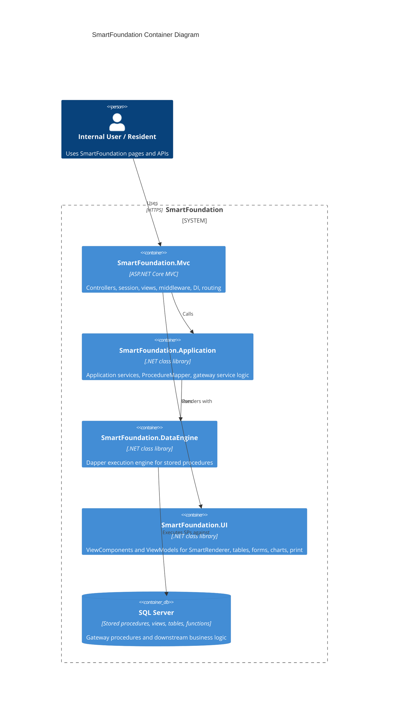

# SmartFoundation Executive Summary

This is the stakeholder-oriented version of the full system analysis. For detailed technical findings, see `system-analysis.md`.

---

## What SmartFoundation Is

SmartFoundation is an internal enterprise web application built on ASP.NET Core 8 MVC. It powers multiple organizational modules including Housing management, electronic billing, income/financial auditing, and control panel administration.

The system is **database-driven**: most business logic lives in SQL Server stored procedures, and the web layer orchestrates UI assembly and user interaction.

---

## System at a Glance

| Metric | Value |
|---|---|
| Projects in solution | 7 |
| Controller files | 46 |
| ViewComponents | 7 |
| Application services | 5 |
| Database stored procedures (snapshot) | 67+ |
| Database tables (snapshot) | 180+ |
| Automated test files | 5 |

---

## Architecture

---

## How a Page Works

Every major feature page follows the same proven pattern:

This pattern is consistent across all Housing, ControlPanel, ElectronicBillSystem, and IncomeSystem pages.

---

## What the System Does Well

- **Consistent page pattern**: 25+ pages share the same controller/service/SP architecture
- **Server-side permission gating**: every page checks database-driven permissions before showing actions
- **Reusable UI components**: tables, forms, charts, print views, and date pickers are all shared components
- **Gateway stored procedure model**: business logic is isolated in SQL, not scattered across controllers
- **Multi-result page assembly**: a single database call can return permissions, data, and lookup lists together
- **Generic CRUD**: modal forms across all pages post to shared insert/update/delete endpoints

---

## Areas Requiring Attention

| Area | Issue | Risk Level |
|---|---|---|
| Session middleware | `SessionGuardMiddleware` exists but is not wired into the pipeline | Medium |
| Test coverage | Only 5 test files, no MVC or integration tests | Medium |
| Debug logging | `Console.WriteLine` in production code paths | Low |
| Dead code | Empty `ChartDataService.cs`, stale root `Program.cs` | Low |
| SP bug | `GetExtraDataLoadDataSetAsync` has positional arg indexing issue | Medium |
| Authorization | No `[Authorize]` attributes; relies entirely on session + DB permissions | Medium |

None of these are blocking issues, but they should be addressed as the platform matures.

---

## Readiness for New Features

SmartFoundation is well-suited for adding new internal workflow modules. The existing Housing pattern provides a proven template for:

- multi-page feature areas with complex permissions
- approval and review workflows
- list/detail/inbox pages
- dashboard and reporting views
- print and PDF output

The system does not currently support:

- file attachments (would need new infrastructure)
- rich client-side workflows (current UI is server-driven)
- policy-based authorization (current model is session-based)

---

## Ticketing System Fit

The Multi-Department Ticketing System described in `plan.md` is a strong fit for this platform.

The ticketing system needs are already well-supported by existing patterns:

| Ticketing Need | SmartFoundation Capability |
|---|---|
| Ticket list/detail pages | Housing-style page assembly with `SmartTableDS` |
| Service catalog admin | ControlPanel-style CRUD maintenance |
| Queue inbox views | `SmartTableDS` with permission-gated actions |
| Approval/review workflows | Housing action/permission pattern |
| SLA dashboards | `SmartCharts` card ecosystem |
| Print/reports | `SmartPrint` and QuestPDF |
| Audit trail | SQL-side `AuditLog` + history table pattern |

What must still be built:

- `[Tickets]` database schema (lookup, transaction, history tables, views, procedures)
- ticketing controller family and Razor views
- ticketing-specific stored procedures for lifecycle management
- workflow-specific test coverage

---

## Recommendation

Build the ticketing system as a first-class SmartFoundation module using the Housing-era pattern as the baseline. This means:

1. follow the MVC -> Application -> DataEngine -> gateway SP architecture
2. keep business validation in stored procedures
3. use `SmartRenderer`, `SmartTableDS`, `SmartForm`, and `SmartCharts` for UI
4. implement in small spec-by-spec slices as described in `plan.md`
5. add automated tests for each spec before moving to the next

For the full technical analysis, see `system-analysis.md`.
For the implementation checklist, see `ticketing-implementation-checklist.md`.
For the ticketing-specific architecture design, see `ticketing-architecture.md`.
