# SmartFoundation Full System Analysis

## 1. Executive Summary

SmartFoundation is an internal ASP.NET Core 8 MVC solution with a mixed architecture, but the most reliable and actively repeated implementation style is the Housing-era pattern built around multi-result `DataSet` responses, gateway stored procedures, thin Razor views, and server-built UI models.

This analysis has two goals:

- provide a full audit of the current SmartFoundation system as it exists today
- map those findings to the proposed Multi-Department Ticketing System described in `plan.md`

At a high level, the platform is composed of:

- `SmartFoundation.Mvc` as the real web application and composition root
- `SmartFoundation.Application` as the application/service layer
- `SmartFoundation.DataEngine` as the Dapper-based stored procedure execution layer
- `SmartFoundation.UI` as the reusable ViewComponent and ViewModel library
- `SmartFoundation.Database` as a snapshot/reference database project
- `SmartFoundation.Application.Tests` as the current automated test project

The system is database-driven. In active Housing-style flows, controllers do not directly implement business logic. Instead, they:

- read session-backed context
- prepare positional or named parameters
- call `MastersServies`
- receive a `DataSet`
- split the result into permissions and feature tables
- build `SmartPageViewModel`, `FormConfig`, and `SmartTableDsModel`
- render through `SmartRenderer`

This architecture is consistent, powerful, and proven inside the repository, but it also introduces important constraints:

- strict dependence on gateway SP contracts such as `pageName_`, `ActionType`, `idaraID`, `entrydata`, and `hostname`
- heavy reliance on SQL-side routing and validation
- minimal controller-side authorization attributes
- session-based authentication rather than modern policy-based authorization

### 1.1 System Metrics

The current repository inventory shows the following:

- 7 projects/files at the solution level (`.csproj` + `.sqlproj` + solution)
- 46 controller files in `SmartFoundation.Mvc`
- 7 ViewComponents in `SmartFoundation.UI`
- 5 main Application-layer service files, plus service models
- 22 `dbo` stored procedures in the database project
- 45 Housing stored procedures in the database project
- 64 view files across `dbo` and `Housing`
- 45 function files across `dbo` and `Housing`
- 180+ table scripts in the database snapshot
- 5 test files in `SmartFoundation.Application.Tests`

### 1.2 Core Architectural Conclusion

If a new feature resembles the Housing module in complexity, server-driven UI assembly, or stored-procedure-centric behavior, the safest implementation strategy is to copy the Housing pattern first.

For the ticketing system in `plan.md`, this means:

- follow the MVC -> Application -> DataEngine -> gateway SP model
- preserve the generic CRUD contract where practical
- keep thin Razor views
- build page models on the server
- let stored procedures own validation, routing rules, and audit behavior

---

## 2. Architecture Overview

SmartFoundation follows a practical layered architecture. The documentation often refers to Clean Architecture, but the most important runtime truth is this:

- MVC controllers orchestrate requests and UI assembly
- Application services translate business operations into stored procedure calls
- DataEngine executes those procedures through Dapper
- SQL Server holds the real business behavior for many active modules

### 2.1 Container View

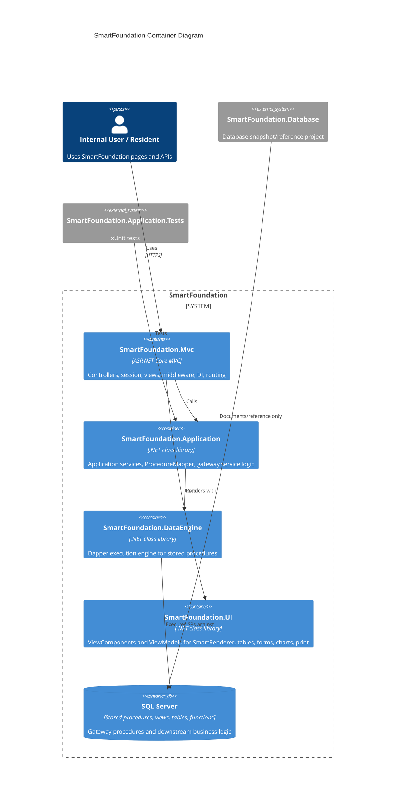

### 2.2 Dependency Direction

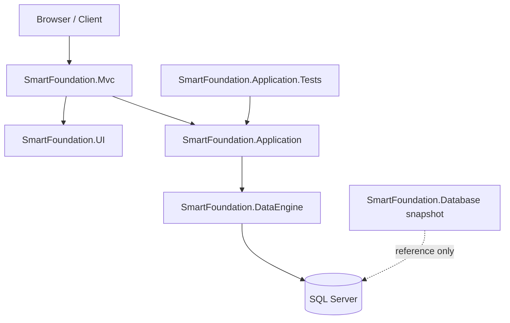

### 2.3 What Is Actually “Current”

Several repository instructions emphasize the same rule: trust active code over migration-era documentation.

The strongest current references are:

- `SmartFoundation.Mvc/Controllers/Housing/WaitingList/HousingController.WaitingListByResident.cs`
- `SmartFoundation.Mvc/Controllers/Housing/HousingController.Base.cs`
- `SmartFoundation.Mvc/Controllers/CrudController.cs`
- `SmartFoundation.Application/Services/MastersServies.cs`
- `SmartFoundation.DataEngine/Core/Services/SmartComponentService.cs`

This means the system is best understood as a proven operational MVC application with a Housing-style baseline, not as a purely abstract Clean Architecture exercise.

---

## 3. Project Inventory

### 3.1 Solution Structure

| Project/File | Role | Notes |
|---|---|---|
| `SmartFoundation.sln` | Solution container | Includes app, services, UI, tests, DB snapshot |
| `SmartFoundation.Mvc` | Real application entrypoint | Main runtime project |
| `SmartFoundation.Application` | Application services | Gateway service layer and procedure mapping |
| `SmartFoundation.DataEngine` | Data access engine | Dapper executor with multi-result support |
| `SmartFoundation.UI` | Reusable UI library | ViewComponents and strongly-typed page models |
| `SmartFoundation.Application.Tests` | Tests | Current automated test coverage |
| `SmartFoundation.Database` | DB snapshot/reference | Helpful for intent, not source of truth |

### 3.2 MVC Inventory Summary

`SmartFoundation.Mvc` contains:

- 46 controller files
- multiple controller families implemented as partial classes
- the real `Program.cs`
- session and middleware configuration
- all Razor views used by the app
- presentation helpers such as PDF export and AI assistant services

The controller families include:

- Housing
- ControlPanel
- ElectronicBillSystem
- IncomeSystem
- Home
- Login
- API and utility controllers

### 3.3 Application Layer Inventory

`SmartFoundation.Application` contains:

- `BaseService`
- `MastersServies`
- `EmployeeService`
- `DashboardService`
- `ChartDataService` (currently empty)
- `ProcedureMapper`
- DI registration extensions
- service DTOs like `NotificationItem` and `AuthInfo`

### 3.4 DataEngine Inventory

`SmartFoundation.DataEngine` is intentionally small and focused:

- `ISmartComponentService`
- `SmartRequest`
- `SmartResponse`
- `SmartComponentService`
- `ConnectionFactory`

Its job is execution, not business logic.

### 3.5 UI Library Inventory

`SmartFoundation.UI` contains 7 ViewComponents:

- `SmartRenderer`
- `SmartTable`
- `SmartTableDS`
- `SmartForm`
- `SmartPrint`
- `SmartDatePicker`
- `SmartCharts`

The library also contains the ViewModels that drive those components, especially:

- `SmartPageViewModel`
- `SmartTableDsModel`
- `TableConfig`
- `FormConfig`
- `SmartChartsConfig`
- `SmartPrintConfig`

### 3.6 Database Snapshot Inventory

The database project contains a large amount of SQL script content, notably:

- `dbo.Masters_DataLoad`
- `dbo.Masters_CRUD`
- `dbo.Masters_ExtraDataLoad`
- Housing-specific `DL` and `SP` procedures
- a large collection of `dbo` and `Housing` views and functions
- many reference tables for organizational and housing domains

For ticketing-system design, the most relevant lesson is structural, not literal: SmartFoundation already uses gateway procedures that route to downstream feature procedures, and that pattern maps well to `plan.md`.

---

## 4. Runtime Request Lifecycle

The runtime request lifecycle differs slightly by controller type, but the canonical Housing path is the one most worth understanding.

### 4.1 Canonical Housing Request Flow

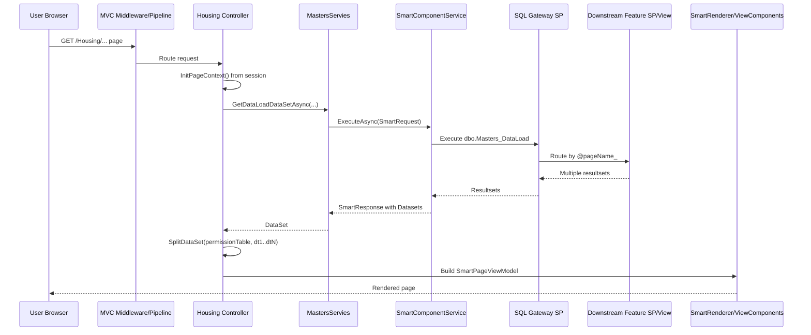

### 4.2 Key Runtime Rules

The canonical page flow uses these steps:

1. read shared session values such as `usersId`, `IdaraId`, and `HostName`
2. set `PageName` and controller context
3. call `MastersServies.GetDataLoadDataSetAsync(...)`
4. split the returned `DataSet`
5. treat table 0 as permissions
6. treat later tables as data or lookup sources
7. build server-side table and form configs
8. render through `SmartRenderer`

### 4.3 CRUD Runtime Flow

Interactive writes generally happen through `CrudController`, not directly through feature controllers.

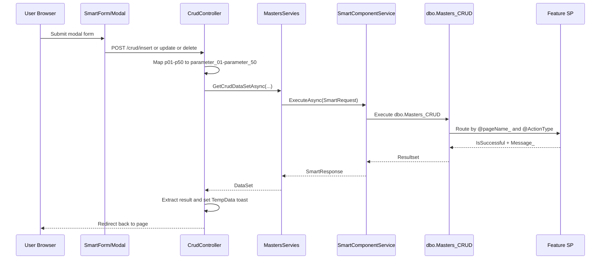

### 4.4 API/Utility Runtime Flow

Some controllers are not Housing-style page controllers. API controllers such as:

- `AiController`
- `NotificationsController`
- `SmartComponentController`
- `ExportsController`

return JSON or binary output rather than server-rendered page models.

These are the minority pattern in the repository, but they matter for cross-cutting capabilities like AI, notifications, and PDF export.

---

## 5. Presentation Layer Analysis

The Presentation Layer lives in `SmartFoundation.Mvc`. It includes the real runtime entrypoint, controllers, views, middleware, app configuration, and some presentation-focused services.

### 5.1 Controller Families

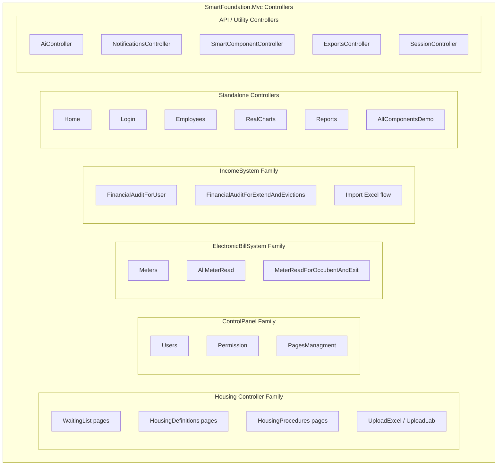

### 5.2 The Dominant Pattern: Partial Controller Families

Several major controller groups are split across multiple files using partial classes. This keeps large functional areas organized by feature page rather than by one giant file.

Examples:

- `HousingController.Base.cs` + many `HousingController.*.cs` feature files
- `ControlPanelController.Base.cs` + permission/menu pages
- `ElectronicBillSystemController.Base.cs` + meter pages
- `IncomeSystemController.Base.cs` + audit pages

This is an important system design choice because it means controller “classes” are really feature families, not isolated one-file units.

### 5.3 Housing Controller Pattern

The Housing family is the canonical implementation style.

Common characteristics:

- injects `MastersServies` and `CrudController`
- calls `InitPageContext(out redirectResult)` early
- uses session-backed values such as `usersId`, `IdaraId`, `hostName`
- sets `PageName`
- calls `GetDataLoadDataSetAsync(...)`
- splits result tables via base-class helpers
- derives permissions from the first table using `permissionTypeName_E`
- builds `SmartTableDsModel`, `FormConfig`, and `SmartPageViewModel`
- returns a thin Razor view that usually invokes `SmartRenderer`

This pattern is repeated across:

- Waiting List pages
- Housing Definitions pages
- Housing Procedures pages
- related reporting and print screens

### 5.4 ControlPanel, ElectronicBillSystem, and IncomeSystem

These controller families largely reuse the same baseline pattern with domain-specific variations:

- multiple tables per page
- DDL loading through `CrudController`
- permission-gated toolbar actions
- PDF exports on some pages
- conditional row styling and badges

They are variations on the Housing baseline, not a different architectural model.

### 5.5 Non-Housing Controllers

Not every controller follows the Housing pattern.

There are three important alternative styles:

- utility/demo controllers with hardcoded page models or chart models
- API controllers returning JSON or raw results
- special-purpose controllers such as login, reports, uploads, and exports

Examples:

- `DashboardController` and `StatisticsController` are mostly demo/static
- `SmartComponentController` exposes direct execution through the DataEngine
- `AiController` handles AI chat and feedback APIs
- `ReportsController` demonstrates QuestPDF report output

### 5.6 Thin Views by Design

The most important presentation-layer principle is that many views are intentionally thin.

In Housing-style pages, the view usually does little more than:

- receive a prepared model
- invoke `SmartRenderer`
- avoid embedding major business or data logic in Razor

This is a strong design pattern for the future ticketing system because it reduces duplication and keeps behavior centralized.

---

## 6. Application Layer Analysis

The Application Layer lives in `SmartFoundation.Application` and is small but highly influential.

### 6.1 Class Relationships

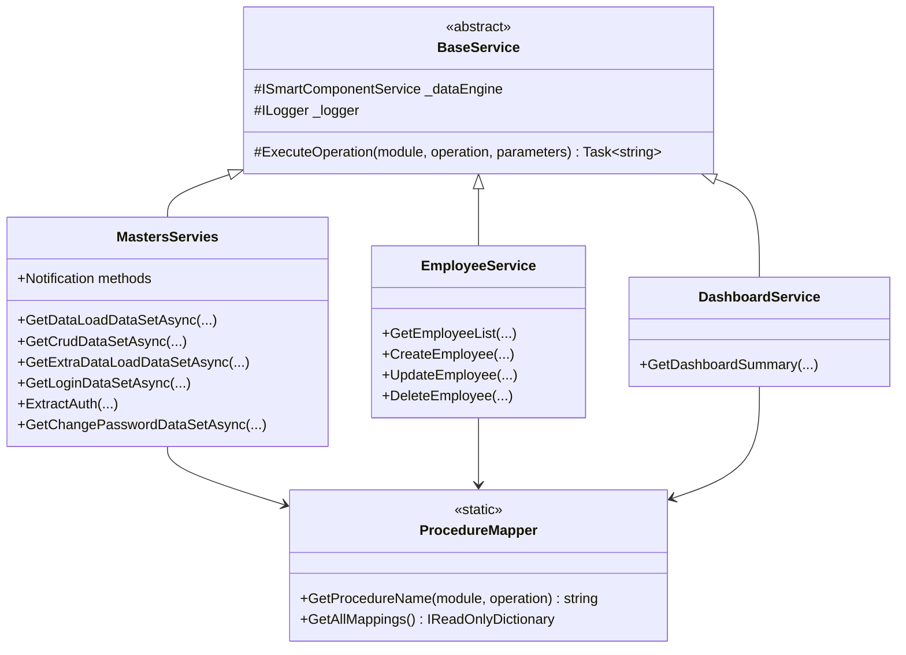

### 6.2 BaseService

`BaseService` provides the standardized JSON-returning execution path.

Its core responsibility is:

- resolve SP names through `ProcedureMapper`
- build `SmartRequest`
- call `_dataEngine.ExecuteAsync(...)`
- wrap the result in a standardized JSON response string

This is a good base pattern for focused services, but it is not the dominant path for Housing-style pages.

### 6.3 MastersServies Is the Real Gateway Service

`MastersServies` is the most important application service in the current system.

It supports:

- DataLoad via `dbo.Masters_DataLoad`
- CRUD via `dbo.Masters_CRUD`
- ExtraDataLoad via `dbo.Masters_ExtraDataLoad`
- login/session loading via `dbo.GetSessionInfoForMVC`
- password change via `dbo.ReSetUserPassword`
- notifications via `dbo.Notifications_CRUD`
- menu loading via `dbo.GetUserMenuTree`

Architecturally, `MastersServies` is the bridge between MVC controller orchestration and the SQL gateway procedure model.

### 6.4 Two Return-Type Patterns

The Application Layer has two important output styles:

- `Task<string>` JSON responses for narrower service-style operations
- `Task<DataSet>` responses for Housing-style page orchestration

That split is critical.

The first style suits API-like or narrow service operations.
The second style suits multi-table page assembly where controllers expect permissions plus multiple data/lookup resultsets.

### 6.5 ProcedureMapper

`ProcedureMapper` is a centralized mapping table from logical operations to stored procedure names.

Important mappings include:

- `MastersDataLoad:getData` -> `dbo.Masters_DataLoad`
- `MastersExtraDataLoad:getData` -> `dbo.Masters_ExtraDataLoad`
- `MastersCrud:crud` -> `dbo.Masters_CRUD`
- `auth:sessions_` -> `dbo.GetSessionInfoForMVC`
- `auth:changePassword` -> `dbo.ReSetUserPassword`

The key repo rule is that `ProcedureMapper` should map entry/gateway procedures exposed to the app layer, not every downstream business procedure.

That aligns very well with the planned ticketing architecture in `plan.md`.

### 6.6 Important Observations

- `EmployeeService` is a simple BaseService-style example, but currently maps all actions to the same demo SP
- `DashboardService` is a narrow single-method service
- `ChartDataService.cs` exists but is empty
- `MastersServies` contains the most mature implementation logic in the project

---

## 7. DataEngine Analysis

`SmartFoundation.DataEngine` is the stored procedure execution engine.

Its job is to accept a `SmartRequest`, convert it into Dapper parameters, execute a procedure, and return a `SmartResponse` that can represent one or many resultsets.

### 7.1 DataEngine Execution Pipeline

```mermaid
flowchart LR
    A[Raw request.Params] --> B[JsonElement unwrap]
    B --> C[bool to int conversion]
    C --> D[whitespace string to null]
    D --> E[null to DBNull.Value]
    E --> F[@ prefix added to key]
    F --> G[DynamicParameters]
    G --> H[QueryMultipleAsync]
    H --> I{Success?}
    I -- Yes --> J[Read all resultsets into Datasets]
    I -- No --> K[Fallback to QueryAsync]
    K --> L[Wrap single resultset]
    J --> M[SmartResponse]
    L --> M
```

### 7.2 SmartRequest Model

`SmartRequest` carries:

- `SpName`
- `Operation`
- `Params`
- optional paging, sorting, filtering, and metadata

One key runtime rule is that paging/sort/filter behavior only applies when `Operation == "select"`.

Many active SmartFoundation flows use `Operation = "sp"`, which means those helper parameters are not added.

### 7.3 Parameter Handling Rules

The service automatically adds `@` prefixes to parameter names, so application code must not include `@` in the keys.

It also normalizes values by:

- unwrapping `JsonElement`
- converting `bool` to `1` or `0`
- turning empty/whitespace strings into `null`
- sending `DBNull.Value` to SQL where needed

This behavior matters because the app and SQL contract depend on exact parameter names such as `pageName_`, `ActionType`, and `parameter_01`.

### 7.4 Multi-Result Support

The biggest reason the DataEngine matters is multi-result support.

`SmartComponentService` tries `QueryMultipleAsync` first, which allows it to preserve:

- permissions table
- main feature data
- additional tables for DDLs, summaries, letters, child entities, and extra page metadata

If the multi-result path fails, it falls back to `QueryAsync`.

That fallback makes the DataEngine more resilient, but the multi-result path is what powers the Housing architecture.

### 7.5 DataEngine and Ticketing Fit

The ticketing system in `plan.md` expects multiple read models, dashboard outputs, list/detail pages, and strongly enforced write actions. The DataEngine already supports this style well.

It is especially suitable for:

- `TicketDL`
- `ServiceDL`
- `ArbitrationDL`
- `DashboardDL`
- ticket write multiplexers such as `TicketSP` and `ServiceSP`

---

## 8. UI Component Library Analysis

`SmartFoundation.UI` is a reusable component library for building server-configured pages.

### 8.1 Rendering Composition

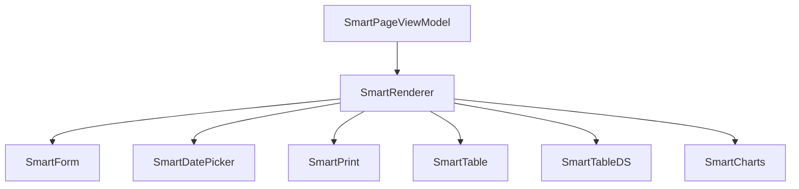

### 8.2 SmartRenderer

`SmartRenderer` is the master orchestration component.

It accepts `SmartPageViewModel` and conditionally renders:

- forms
- tables
- charts
- print sections
- date pickers
- multiple `SmartTableDS` instances on one page

This is the key reason many Razor views remain thin.

### 8.3 SmartTableDS

`SmartTableDS` is the most important table component for Housing-style pages.

It supports:

- preloaded row sets
- toolbar actions
- filtering and search
- pagination
- row actions
- modals
- profile mode
- toggle mode
- section mode
- tab mode
- style rules and badge/pill rendering

This is a strong fit for ticket inboxes, SLA dashboards, service-catalog administration, arbitration queues, and quality review views.

### 8.4 SmartForm

`SmartForm` provides a dynamic field model with support for:

- text inputs
- selects and Select2
- checkboxes and radios
- textareas
- files
- date inputs
- validation hints and patterns
- hidden fields
- custom buttons

This component can support a large portion of the ticketing system UI, particularly if the project continues to prefer server-assembled forms rather than heavy SPA logic.

### 8.5 SmartCharts and SmartPrint

`SmartCharts` supports a broad range of visual cards, including KPI and operational dashboard components.

`SmartPrint` supports printable document compositions, which could be useful for:

- ticket summaries
- arbitration decision print views
- quality-review reports
- operational dashboards

### 8.6 SmartPageViewModel as the UI Contract

`SmartPageViewModel` is the page assembly contract for server-side composition.

It can contain:

- one form
- one standard table
- multiple dataset-driven tables
- charts
- print content
- date picker models

This model is ideal for complex internal business pages where the server prepares a full operational screen based on stored-procedure outputs.

---

## 9. Database Layer Analysis

The database layer is where much of SmartFoundation’s operational behavior lives.

### 9.1 Architectural Principle

The active system prefers gateway stored procedures that route by page or action to downstream feature procedures.

This is especially clear in Housing.

### 9.2 Stored Procedure Routing Model

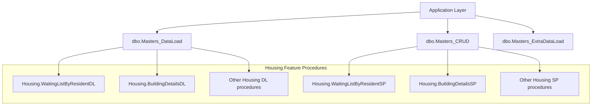

### 9.3 Gateway Contract

The key parameter names used repeatedly are:

- `pageName_`
- `ActionType`
- `idaraID`
- `entrydata`
- `hostname`
- `parameter_01` through `parameter_50`

These must not be casually renamed. They are part of the runtime contract.

### 9.4 Dataset Semantics

In active Housing code, result tables carry stable meaning:

- table 0 = permissions
- later tables = page data, child data, lookup lists, print data, secondary summaries, or extra lists

The system is built around that convention, and controllers rely on it.

### 9.5 Database Scope Overview

The database snapshot contains:

- organizational tables in `dbo`
- Housing domain tables, views, and procedures
- notification-related procedures
- AI chat procedures
- menu and session procedures
- audit and error logging infrastructure

### 9.6 Simplified Structural ER View

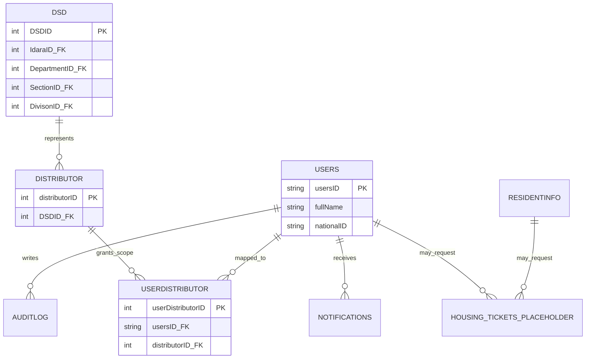

The `HOUSING_TICKETS_PLACEHOLDER` entity above is illustrative only. It shows the kind of org-linked model a future ticketing schema would connect to.

### 9.7 Ticketing-System Database Fit

The ticketing design in `plan.md` expects:

- a dedicated `[Tickets]` schema
- lookup tables, transaction tables, history tables, views, DL procedures, and SP procedures
- queue routing based on organizational truth
- audit and history logging

That is highly compatible with SmartFoundation’s current database philosophy.

The most natural database architecture for the new feature would be:

- `[Tickets].[TicketDL]`, `[Tickets].[ServiceDL]`, `[Tickets].[ArbitrationDL]`, `[Tickets].[DashboardDL]`
- `[Tickets].[TicketSP]`, `[Tickets].[ServiceSP]`, `[Tickets].[ArbitrationSP]`, `[Tickets].[ClarificationSP]`, `[Tickets].[QualityReviewSP]`
- an application-layer mapping to gateway entry procedures if the feature follows the established gateway model

---

## 10. Authentication and Authorization Analysis

Authentication and authorization in SmartFoundation are practical and session-driven rather than modern attribute/policy-driven.

### 10.1 Auth Flow

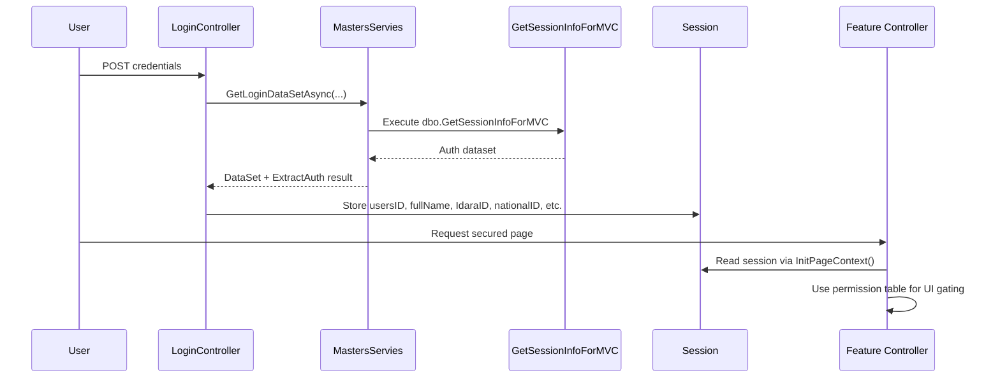

### 10.2 Login Model

`LoginController`:

- renders the login page
- validates credentials through `MastersServies`
- stores many session values
- clears session on logout
- exposes a password-change endpoint

### 10.3 SessionGuardMiddleware Exists but Is Not Wired In

`SessionGuardMiddleware` checks required session keys and can redirect unauthorized users to login or return `401` for AJAX/JSON requests.

However, it is not currently registered in `SmartFoundation.Mvc/Program.cs`.

This is an important operational observation:

- a security guard exists
- but it is not active in the middleware pipeline as currently configured

### 10.4 Permission Model

Page-level permissions in Housing-style flows come from the first result table, usually using `permissionTypeName_E`.

These permissions gate UI actions such as:

- insert
- update
- delete
- movement between workflow states
- approval/rejection actions

This is a powerful server-driven model and is very relevant to the ticketing system in `plan.md`.

### 10.5 No Widespread `[Authorize]` Usage

The repository analysis found no broad use of `[Authorize]` attributes in controllers.

Instead, access is shaped by:

- session state
- procedural validation
- page permissions returned from the database

That is workable, but it is less explicit than policy-based authorization and should be treated carefully in future expansion.

---

## 11. CRUD Contract Analysis

`CrudController` is a central architectural component, not an incidental helper.

### 11.1 Generic CRUD Contract

The controller supports:

- `/crud/insert`
- `/crud/update`
- `/crud/delete`
- DDL-loading endpoints
- extra data load endpoints
- form rendering endpoints

### 11.2 Parameter Mapping Rules

The generic form contract uses:

- `p01` through `p50` for posted form values
- `parameter_01` through `parameter_50` for SQL mapping

It also expects hidden context fields such as:

- `pageName_`
- `ActionType`
- `idaraID`
- `entrydata`
- `hostname`
- redirect fields

### 11.3 Generic Write Flow Significance

This contract allows feature pages to avoid writing custom insert/update/delete controllers for every modal form.

That is a major productivity pattern in the current system.

For the ticketing system, this raises an architectural choice:

- either reuse the generic CRUD pattern for many ticket actions
- or create feature-specific action endpoints where the action semantics are too rich for a generic `p01..p50` mapping

Given the complexity in `plan.md`, a hybrid approach would likely be best.

### 11.4 CRUD Contract Sequence

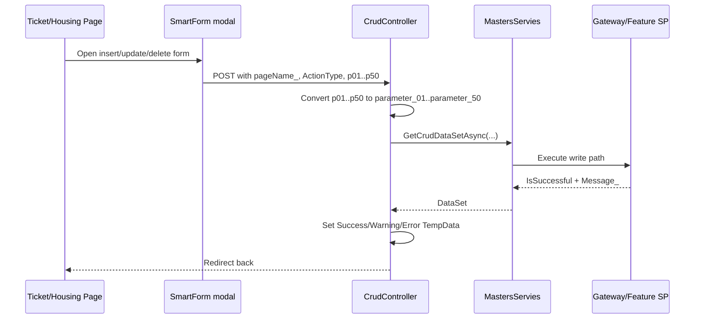

### 11.5 Ticketing-System CRUD Suitability

This generic contract is a strong fit for:

- lookup maintenance
- service catalog maintenance
- simple routing-rule management
- quality review decisions

It may be less ideal for:

- complex multi-step ticket lifecycle transitions
- heavily contextual arbitration decisions
- child-ticket creation with multiple conditional branches

Those areas may deserve dedicated feature actions or richer forms.

---

## 12. Frontend Stack Analysis

The frontend is not a SPA. It is a server-driven MVC frontend enhanced with JavaScript libraries.

### 12.1 Core Frontend Technologies

The active frontend stack includes:

- Razor views
- Tailwind CSS
- Alpine.js
- Select2
- Flatpickr
- ApexCharts-style chart rendering patterns inside UI components
- QuestPDF for PDF generation

### 12.2 Frontend Design Philosophy

The UI layer is componentized but not fully client-rendered.

The server assembles models and configuration, then client-side scripts handle:

- table interaction
- form behavior
- modal rendering
- chart hydration
- filtering and pagination behavior

### 12.3 Strengths

- strong reuse across internal business pages
- low duplication in views
- flexible dynamic tables and forms
- charts and print support already present

### 12.4 Constraints

- advanced workflows still depend heavily on server-prepared configuration
- some behaviors are tied to conventions and string-based configuration
- debugging can be harder when form/table behavior is spread across server config and client helpers

### 12.5 Ticketing-System Frontend Fit

The proposed ticketing system can fit this model well if it emphasizes:

- inbox pages
- detail pages
- action modals
- dashboards
- print/report output

It is less ideal if the future vision requires a highly interactive workflow designer or very dynamic client-only experiences.

---

## 13. Dependency Injection and Configuration Analysis

`SmartFoundation.Mvc/Program.cs` is the runtime composition root.

### 13.1 DI Registration Map

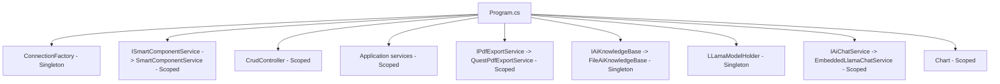

### 13.2 Important Registrations

The runtime registers:

- `ConnectionFactory` as singleton
- `ISmartComponentService` -> `SmartComponentService`
- `CrudController` as a service
- `MastersServies`, `EmployeeService`, `DashboardService`
- PDF export service
- AI-related services
- chart helper service

This supports the current architectural reality where controllers can inject `CrudController` and concrete application services directly.

### 13.3 Middleware Pipeline

The active pipeline includes:

- response compression
- HTTPS redirection
- static files
- routing
- authentication
- authorization
- session
- Razor Pages mapping
- controller mapping
- default route to `Login/Index`

### 13.4 Important Configuration Observation

`UseAuthentication()` and `UseAuthorization()` exist, but the app does not show a corresponding rich policy/scheme-based auth setup in `Program.cs`.

The practical runtime identity model is still session-centric.

---

## 14. Testing Coverage Analysis

The current automated test footprint is limited.

### 14.1 Existing Test Files

Current tests are in `SmartFoundation.Application.Tests` and include:

- `EmployeeServiceTests`
- `MenuServiceTests`
- `DashboardServiceTests`
- basic placeholder tests

### 14.2 What Is Covered

The tests focus mainly on:

- application-service behavior
- JSON-returning service methods
- basic success-path validation

### 14.3 What Is Not Covered

There is currently no dedicated MVC test project and no significant automated coverage for:

- Housing controllers
- CRUD controller behavior
- session-based auth behavior
- ViewComponent rendering logic
- DataEngine multi-result behavior against realistic SP contracts
- ticket-like workflow orchestration

### 14.4 Testing Implications for `plan.md`

The ticketing project is workflow-heavy. That means testing should be deeper than the current baseline.

The future feature should add coverage for:

- stored procedure contract correctness
- action-to-history logging
- audit logging
- inbox/detail read models
- SLA behavior
- arbitration and clarification workflows

This matches the testing strategy already described in `plan.md`.

---

## 15. Code Quality and Risk Observations

This section highlights concrete implementation observations from the current repository.

### 15.1 Positive Characteristics

- the Housing pattern is consistent and repeatable
- server-side permission gating is strong and explicit
- `SmartRenderer` and `SmartTableDS` provide powerful reuse
- the DataEngine supports rich multi-result SP workflows
- SQL gateway routing creates a clear application/database boundary

### 15.2 Technical Debt and Risks

- `ChartDataService.cs` is empty
- the root `Program.cs` is stale and should not be treated as runtime code
- `SessionGuardMiddleware` exists but is not wired into `Program.cs`
- `MastersServies.GetExtraDataLoadDataSetAsync(...)` has positional indexing issues in the current implementation
- there are production-path `Console.WriteLine` calls in some services and middleware
- some docs reference files/services that do not actually exist or are no longer current
- there is minimal automated coverage for the dominant Housing/MVC patterns

### 15.3 Architectural Risks for New Features

When building new features, the largest risk is not technical impossibility. The largest risk is drifting away from the established repository conventions and creating an isolated architectural island.

That would look like:

- bypassing `MastersServies` in flows that should use it
- breaking the gateway SP contract
- moving too much workflow logic into controllers or views
- introducing naming or parameter conventions that conflict with existing patterns

For the ticketing system, consistency with the active architecture is more valuable than theoretical purity.

---

## 16. Mapping to `plan.md`: Ticketing System Integration Analysis

This section maps the proposed Multi-Department Ticketing System to the existing SmartFoundation platform.

### 16.1 Overall Fit Assessment

The ticketing system proposed in `plan.md` is a strong fit for SmartFoundation.

Why it fits:

- the app already supports multi-page internal workflow systems
- the org hierarchy model already exists
- SQL-driven business rules already exist
- multi-result page assembly already exists
- generic CRUD and modal action flows already exist
- dashboard, print, chart, and reporting capabilities already exist

What must still be built:

- the `[Tickets]` schema and all ticket-specific objects
- ticketing-specific read and write procedures
- ticketing controller family and views
- test coverage specific to workflow and SLA behavior

### 16.2 Architectural Mapping Table

| `plan.md` Area | Best Existing SmartFoundation Pattern | Recommendation |
|---|---|---|
| Ticket list/detail pages | Housing page assembly with `SmartTableDS` | Use Housing-style controller + `DataSet` split + `SmartRenderer` |
| Service catalog admin | ControlPanel/Housing definitions CRUD pattern | Reuse generic CRUD for simpler catalog maintenance |
| Arbitration inbox | Queue/inbox style `SmartTableDS` pages | Build as permission-gated table-driven workflow page |
| Clarification flow | Modal action + write SP + history logging | Likely hybrid: generic CRUD for simple steps, dedicated actions for richer transitions |
| Child ticket tree | Multi-table detail screen | Use `TicketDL` to return parent, child, timeline, and SLA tables in one `DataSet` |
| SLA dashboard | `SmartCharts` + `SmartTableDS` | Use server-built cards and lists |
| Quality review | Permission-gated workflow page | Very compatible with Housing action/permission style |

### 16.3 Spec-by-Spec Mapping

#### Spec 01: Lookup Foundations

Best pattern:

- simple CRUD maintenance similar to Housing definition pages
- use `SmartTableDS` and modal forms through `CrudController`

#### Spec 02: Service Catalogue Foundations

Best pattern:

- emulate ControlPanel or Housing definition maintenance pages
- use `ServiceDL` for read pages
- use `ServiceSP` for write actions

This is one of the easiest ticketing specs to fit into current SmartFoundation architecture.

#### Spec 03: Core Ticket Backbone

Best pattern:

- use Housing-style detail/list page composition
- use one `TicketDL` call to load permission table, ticket list, ticket detail, and lookup data as needed

#### Spec 04: Assignment and Work Start

Best pattern:

- queue-based `SmartTableDS` view
- row actions gated by permission table
- write transitions through `TicketSP`

This maps directly to existing action-heavy Housing pages.

#### Spec 05: Clarification Flow

Best pattern:

- detail page with clarification sub-table and action modal
- separate SQL object for clarification behavior

This should remain separate from arbitration, matching both `plan.md` and current repo design preferences.

#### Spec 06: Arbitration Flow

Best pattern:

- dedicated inbox page similar to approval/review pages already present in Housing-style flows
- route decisions through explicit actions in `ArbitrationSP`

#### Spec 07: Parent-Child Ticketing

Best pattern:

- multi-table detail page
- one resultset for parent
- one for child tickets
- one for timeline/history
- one for allowed actions/lookup data

This is a natural fit for the existing DataSet pattern.

#### Spec 08: Blocking and Pause Sessions

Best pattern:

- detail page with current blocking status
- modal actions for pause and resume
- timeline/history tables on the same page

#### Spec 09: SLA Engine

Best pattern:

- SQL-side state and history tables
- UI via `SmartCharts` plus `SmartTableDS`
- dashboard reads through `DashboardDL`

#### Spec 10: Quality Review and Final Closure

Best pattern:

- approval/review style page with permission-driven actions
- row or detail-page actions posted through dedicated SP actions

#### Spec 11: Catalogue Learning and Routing Correction

Best pattern:

- admin maintenance plus decision workflow
- history sub-table for routing corrections

#### Spec 12: Reporting and Dashboards

Best pattern:

- combine `SmartCharts`, `SmartTableDS`, and print/report outputs
- reuse current chart card ecosystem rather than introducing a new dashboard framework

### 16.4 Gaps Between Current Platform and Ticketing Needs

The ticketing system will still need additional design work in these areas:

- explicit ticket-specific permissions and page/action naming conventions
- a decision on whether to route through `dbo.Masters_DataLoad` / `dbo.Masters_CRUD` or introduce a dedicated ticketing gateway
- a clearer authorization story if workflow sensitivity grows beyond current session + permission-table patterns
- stronger automated testing than the current baseline
- likely attachment support in a later phase, since `plan.md` excludes it from V1 but future workflow maturity may require it

### 16.5 Final Recommendation

The best implementation strategy for the Multi-Department Ticketing System is:

1. build it as a first-class SmartFoundation module, not an isolated subsystem
2. follow the Housing controller/service/page assembly pattern for list/detail/workflow pages
3. preserve SQL-side workflow validation and audit/history logic
4. use `SmartTableDS`, `SmartForm`, `SmartCharts`, and `SmartRenderer` as the primary UI building blocks
5. keep `ProcedureMapper` focused on entry procedures, not every downstream procedure
6. implement the project in the narrow spec slices already defined in `plan.md`

In short, `plan.md` is compatible with SmartFoundation, but it should be implemented in SmartFoundation’s active style, especially the Housing-era style, if the goal is maintainability and consistency with the rest of the repository.

---

## 17. Final Conclusions

SmartFoundation is not a greenfield platform. It already has a mature operational pattern.

That pattern is:

- session-aware MVC controllers
- application-layer gateway services
- Dapper-based SP execution
- SQL-owned business routing and validation
- `DataSet`-driven page composition
- server-built UI models rendered by reusable ViewComponents

That pattern is the correct baseline for major new internal workflow features.

The ticketing system in `plan.md` can be implemented successfully on top of this architecture if it respects the platform’s existing conventions instead of bypassing them.

The single most important implementation guidance is simple:

- if the new feature looks like Housing, build it like Housing first
