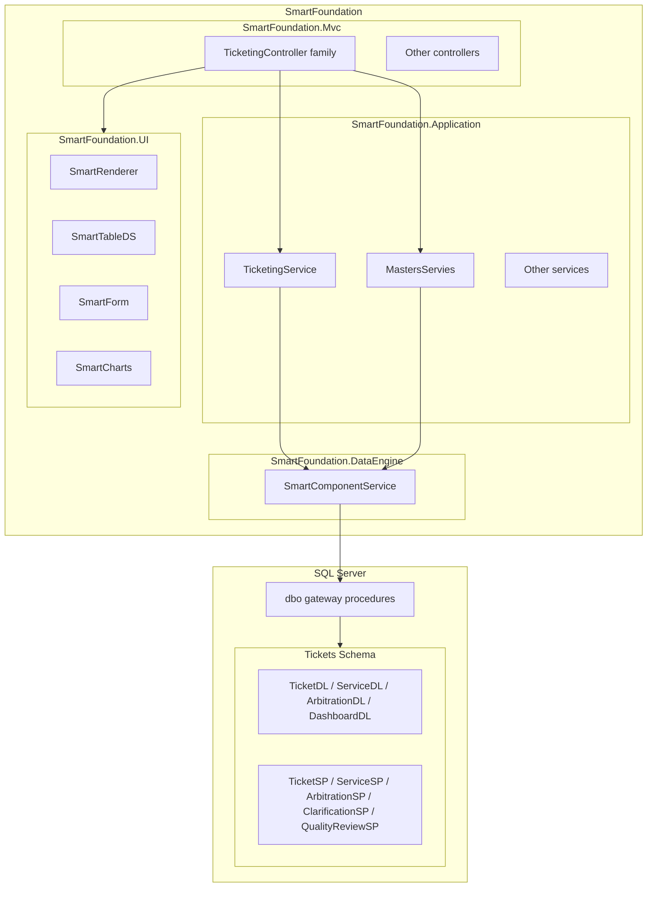
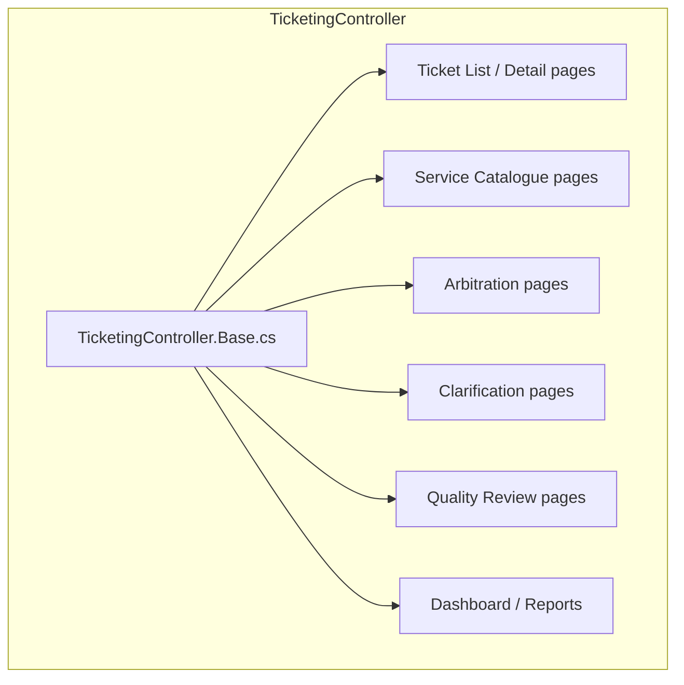
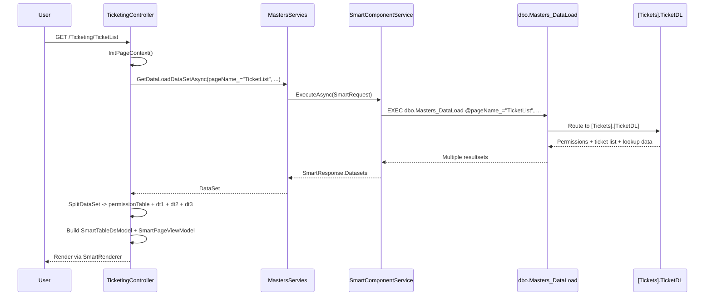
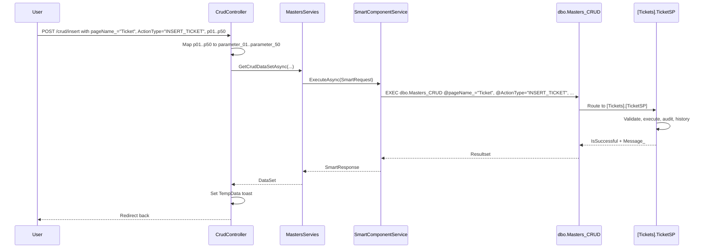
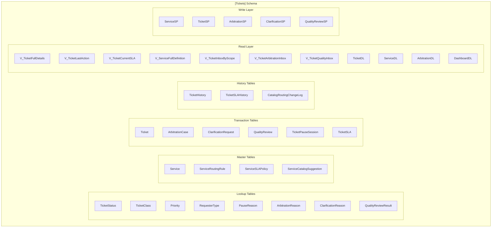
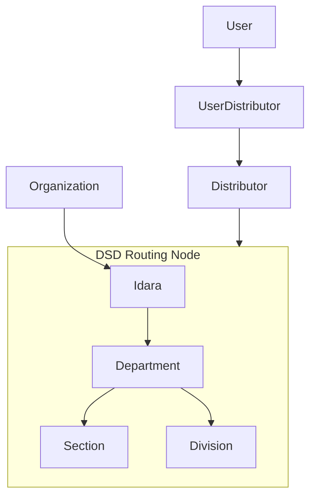

# Ticketing System Architecture

Module-specific architecture for the Multi-Department Ticketing System described in `plan.md`, built on SmartFoundation.

---

## 1. Module Position in SmartFoundation

The ticketing system is a new business module, not a separate application. It lives inside the existing SmartFoundation solution and follows its established patterns.



---

## 2. Architectural Decisions

### 2.1 Database-First

All business write operations execute through stored procedures. Read operations use DL procedures and views.

This matches the existing SmartFoundation model and the explicit requirement in `plan.md`.

### 2.2 Schema Isolation

All ticketing objects live under `[Tickets]`. This isolates the new module from existing schemas (`dbo`, `Housing`) while still sharing the gateway routing layer.

### 2.3 Gateway Integration Strategy

Two viable options exist for connecting the ticketing module to the application layer:

**Option A: Route Through Existing Gateways**

- add `@pageName_` entries for ticketing pages in `dbo.Masters_DataLoad` and `dbo.Masters_CRUD`
- ticketing DL and SP procedures are called via the same gateway path as Housing pages
- controllers call `MastersServies.GetDataLoadDataSetAsync(...)` and `GetCrudDataSetAsync(...)`
- simplest integration, maximum reuse

**Option B: Dedicated Application Service**

- create a `TicketingService` in `SmartFoundation.Application` that inherits `BaseService`
- map ticketing procedures in `ProcedureMapper`
- controllers call `TicketingService` instead of `MastersServies`
- cleaner separation, but more application-layer code

**Recommendation:** Use Option A for V1 because it requires the least new application code and follows the proven Housing pattern. If the ticketing module grows complex enough to warrant its own service layer, refactor to Option B later.

### 2.4 Controller Family Pattern

The ticketing module should be implemented as a partial controller family, matching the Housing pattern:



### 2.5 UI Component Selection

| Page Type | Primary Component | Supporting Components |
|---|---|---|
| Ticket list / inbox | `SmartTableDS` | `SmartForm` (filters), `SmartCharts` (stats) |
| Ticket detail | `SmartTableDS` (sub-tables) | `SmartForm` (actions), `SmartPrint` (print) |
| Service catalog admin | `SmartTableDS` | `SmartForm` (modal CRUD) |
| Arbitration inbox | `SmartTableDS` | `SmartForm` (decision modal) |
| Quality review | `SmartTableDS` | `SmartForm` (review modal) |
| Dashboard | `SmartCharts` | `SmartTableDS` (overdue lists) |
| Reports | `SmartPrint` | `SmartTableDS` |

---

## 3. Request Routing

### 3.1 Read Path



### 3.2 Write Path



---

## 4. Database Architecture

### 4.1 Schema Layout



### 4.2 Key Design Rules

| Rule | Detail |
|---|---|
| Core IDs | `BIGINT` for transaction and history tables |
| Lookup IDs | `INT` |
| `idaraID_FK` | Included in most tables for filtering and reporting |
| `TargetDSDID_FK` | The routing truth; never replace with display-only labels |
| `ParentTicketID_FK` / `RootTicketID_FK` | Required in `Ticket` for tree support |
| Soft delete | Only where explicitly designed (e.g., `Service`) |
| History immutability | `TicketHistory` records are never soft-deleted |

### 4.3 SP Write Contract

Every write procedure follows this template:

```sql
CREATE PROCEDURE [Tickets].[TicketSP]
    @pageName_      NVARCHAR(200),
    @ActionType     NVARCHAR(200),
    @idaraID        INT,
    @entrydata      NVARCHAR(MAX),
    @hostname       NVARCHAR(200),
    @parameter_01   NVARCHAR(MAX) = NULL,
    -- ... up to @parameter_50
AS
BEGIN
    SET NOCOUNT ON;
    SET XACT_ABORT ON;

    IF @ActionType = 'INSERT_TICKET'
    BEGIN
        BEGIN TRY
            BEGIN TRAN;
            -- validate inputs
            -- check permissions
            -- insert ticket
            -- insert ticket history
            -- insert audit log
            COMMIT TRAN;
            SELECT 1 AS IsSuccessful, N'Ticket created.' AS Message_;
            RETURN;
        END TRY
        BEGIN CATCH
            IF @@TRANCOUNT > 0 ROLLBACK TRAN;
            -- log to dbo.ErrorLog if unexpected
            THROW;
        END CATCH
    END

    -- other actions...
END
```

### 4.4 DL Read Contract

Every DL procedure returns multiple resultsets:

- resultset 0: permissions (via `dbo.ft_UserPagePermissions`)
- resultset 1: primary page data
- resultset 2+: lookup data, sub-tables, summaries

This matches the Housing `DL` pattern exactly.

---

## 5. Application Layer Design

### 5.1 Service Strategy for V1

For V1, the ticketing module reuses `MastersServies` because the gateway procedures already route by `@pageName_`.

No new application service is strictly required for basic pages.

### 5.2 When to Add TicketingService

Add a dedicated `TicketingService` if:

- the module needs orchestration across multiple SPs in a single action
- the module needs response shaping that `MastersServies` does not provide
- workflow logic cannot live entirely in SQL

### 5.3 ProcedureMapper Entries

If using the gateway approach, minimal new entries are needed:

- `MastersDataLoad:getData` already maps to `dbo.Masters_DataLoad`
- `MastersCrud:crud` already maps to `dbo.Masters_CRUD`
- the gateway procedures themselves route to `[Tickets].*` procedures by `@pageName_`

If using a dedicated service later, add entries such as:

- `ticketing:list` -> `dbo.Masters_DataLoad`
- `ticketing:create` -> `dbo.Masters_CRUD`
- `ticketing:dashboard` -> `dbo.Masters_DataLoad`

---

## 6. Controller Design

### 6.1 Controller File Structure

```
SmartFoundation.Mvc/Controllers/Ticketing/
    TicketingController.Base.cs
    Ticketing/
        TicketingController.TicketList.cs
        TicketingController.TicketDetail.cs
    ServiceCatalogue/
        TicketingController.ServiceList.cs
        TicketingController.ServiceEdit.cs
    Arbitration/
        TicketingController.ArbitrationInbox.cs
        TicketingController.ArbitrationDecision.cs
    Quality/
        TicketingController.QualityInbox.cs
        TicketingController.QualityReview.cs
    Dashboard/
        TicketingController.Dashboard.cs
```

### 6.2 Base Controller Pattern

`TicketingController.Base.cs` should follow `HousingController.Base.cs`:

- inject `MastersServies` and `CrudController`
- provide `InitPageContext(out redirectResult)`
- provide `SplitDataSet(...)` helpers
- read session values: `usersId`, `IdaraId`, `HostName`

### 6.3 Action Pattern

Each action method follows the Housing style:

1. call `InitPageContext(out redirectResult)`
2. redirect if session invalid
3. set `ControllerName` and `PageName`
4. build positional parameters
5. call `_mastersServies.GetDataLoadDataSetAsync(...)`
6. split result
7. read permissions
8. build table/form/view models
9. return view with `SmartPageViewModel`

---

## 7. View Design

### 7.1 Razor View Structure

```
SmartFoundation.Mvc/Views/Ticketing/
    TicketList.cshtml
    TicketDetail.cshtml
    ServiceList.cshtml
    ServiceEdit.cshtml
    ArbitrationInbox.cshtml
    ArbitrationDecision.cshtml
    QualityInbox.cshtml
    QualityReview.cshtml
    Dashboard.cshtml
```

### 7.2 View Pattern

Every view should be thin, typically just:

```cshtml
@model SmartFoundation.UI.ViewModels.SmartPage.SmartPageViewModel
@{
    ViewData["Title"] = "Ticket List";
}
@await Component.InvokeAsync("SmartRenderer", Model)
```

Complex behavior is configured in the controller, not embedded in Razor.

---

## 8. Permission Model

### 8.1 Permission Names

The ticketing module should use `permissionTypeName_E` values matching its workflow actions:

| Permission Name | Controls |
|---|---|
| `CREATETICKET` | Create new ticket |
| `ASSIGNTICKET` | Assign ticket to user |
| `STARTWORK` | Move ticket to in-progress |
| `REJECTTOSUPERVISOR` | Reject back to supervisor |
| `REQUESTCLARIFICATION` | Open clarification request |
| `RESPONDCLARIFICATION` | Respond to clarification |
| `OPENARBITRATION` | Open arbitration case |
| `DECIDEARBITRATION` | Make arbitration decision |
| `CREATECHILDTICKET` | Create child ticket |
| `PAUSETICKET` | Pause ticket |
| `RESUMETICKET` | Resume ticket |
| `RESOLVETICKET` | Operational resolution |
| `QUALITYREVIEW` | Perform quality review |
| `FINALCLOSETICKET` | Final closure |
| `MANAGESERVICECATALOGUE` | Maintain service catalogue |
| `MANAGEROUTINGRULES` | Maintain routing rules |
| `VIEWSERVICECATALOGUESUGGESTIONS` | Review catalogue suggestions |

### 8.2 Permission Flow

Permissions are loaded as part of the `DL` resultsets and used to gate toolbar actions, row actions, and form visibility, matching the existing Housing pattern.

---

## 9. Organizational Model Integration

### 9.1 Existing Hierarchy

The ticketing system reuses the existing organizational model:



### 9.2 Routing Rules

- `TargetDSDID_FK` is the routing truth
- routing may target a section, division, or department directly
- the organizational receiver is a queue/inbox, not necessarily the final executor
- execution assignment to a real user happens after queue receipt

---

## 10. Testing Strategy

### 10.1 SP Contract Tests

For each write procedure action:

- test success path
- test invalid input rejection
- test unauthorized scope rejection
- test transaction rollback on error
- test audit log insertion
- test history insertion

### 10.2 DL Resultset Tests

For each read procedure:

- verify expected number of resultsets
- verify permissions resultset present
- verify column names and types
- verify filtering by organizational scope

### 10.3 Integration Tests

- known service direct routing scenario
- `Other` service arbitration routing scenario
- parent-child dependency scenario
- clarification flow scenario
- quality review two-stage closure scenario
- SLA pause/resume/breach scenario

---

## 11. Deployment Order

1. create `[Tickets]` schema
2. create lookup tables
3. seed lookup values
4. create master tables
5. create transaction tables
6. create history tables
7. create views
8. create DL procedures
9. create SP procedures
10. add `@pageName_` routing entries in gateway procedures
11. add ProcedureMapper entries if needed
12. create controller files
13. create view files
14. run smoke tests

---

## 12. File Reference Map

When implementing the ticketing module, use these existing files as templates:

| What You Need | Copy From |
|---|---|
| Controller base class | `SmartFoundation.Mvc/Controllers/Housing/HousingController.Base.cs` |
| List page controller action | `SmartFoundation.Mvc/Controllers/Housing/WaitingList/HousingController.WaitingList.cs` |
| Detail page with sub-tables | `SmartFoundation.Mvc/Controllers/Housing/WaitingList/HousingController.WaitingListByResident.cs` |
| Definition/CRUD page | `SmartFoundation.Mvc/Controllers/Housing/HousingDefinitions/HousingController.BuildingType.cs` |
| Approval/workflow page | `SmartFoundation.Mvc/Controllers/Housing/WaitingList/HousingController.WaitingListMoveList.cs` |
| Permission-gated actions | Any Housing controller (permission loop pattern) |
| Generic modal CRUD | `SmartFoundation.Mvc/Controllers/CrudController.cs` |
| Gateway service call | `SmartFoundation.Application/Services/MastersServies.cs` |
| DL procedure template | `SmartFoundation.Database/Housing/Stored Procedures/WaitingListByResidentDL.sql` |
| SP procedure template | `SmartFoundation.Database/Housing/Stored Procedures/WaitingListByResidentSP.sql` |
| Thin Razor view | `SmartFoundation.Mvc/Views/Housing/WaitingList/WaitingListByResident.cshtml` |
| SmartTableDS configuration | Any Housing controller's table-building code |
| SmartForm configuration | Any Housing controller's modal-form-building code |
